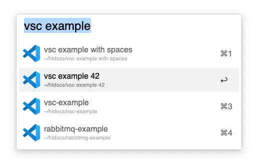

# Alfred VSC workspaces

This workflow for [Alfred](https://www.alfredapp.com/) shows you the folders recently opened in [Visual Studio Code](https://code.visualstudio.com/) and allows you to open them in a new VSC window. You can also filter them by name.

With <kbd>⌘</kbd>+<kbd>C</kbd> you can copy the absolute path. With <kbd>⌘</kbd>+<kbd>Enter</kbd> you open the directory the terminal. Use <kbd>→</kbd> on an result to open the native Alfred file context menu.

To install [download the workflow here](https://github.com/stroebjo/alfred-vsc-workspaces/releases) and open it.
